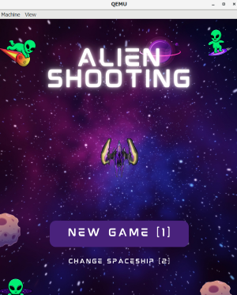

# Alien Shooting: Arcade-style Shooter Game

======================================================

### Project Information

This project is a part of the course EEET2490 – Embedded System: OS and Interfacing, Semester 2024-1, titled 'Screen display & Application development for Bare metal OS'.

#### Team Info

Team Number: 10

Team Members:

- Doan Huu Quoc (s3927776@student.rmit.edu.au)
- Kim Seokyung (s3939114@rmit.edu.vn)
- Tran Vu Quang Anh (s3916566@rmit.edu.vn)
- Nguyen Dinh Viet (s3927291@rmit.edu.vn)

## Introduction

Welcome to Alien Shooting, an immersive arcade-style shooter game where players embark on an exhilarating quest to defend the galaxy against relentless alien invaders. With engaging gameplay mechanics, dynamic progression systems, and challenging boss encounters, Alien Shooting promises hours of thrilling entertainment.

## Objective and Gameplay

In Alien Shooting, players take on the role of a skilled pilot tasked with piloting a spaceship and eliminating waves of alien adversaries. The game features straightforward controls and fast-paced action, making it accessible to players of all skill levels.

### Commands

To play Alien Shooting, follow these commands:

1. **make**: Type "make" in the console to build the project.
2. **image**: Displays an image on the screen. Ensure that the Qemu display is set to windowed mode to prevent size mismatches.
3. **video**: Displays a video. Maintaining windowed mode is recommended to avoid video distortion.
4. **game**: Initiates the game view. Running this command on a real board is not recommended for this assignment.
5. To return to the CLI from any view, type "x".

To start the game, simply press the '1' key from the main menu to enter the game environment.

### Controls

- Movement: Navigate the spaceship using the 'W', 'A', 'S', and 'D' keys. Movement is restricted to the four cardinal directions.
- Firing: The spaceship automatically fires at enemies, eliminating the need for manual input.
- Power-ups: Collect power-up items that periodically descend from the top of the screen to gain advantages such as health replenishment, enhanced firepower, and temporary invulnerability.

### Stages and Boss Encounters

- The game consists of multiple stages, each comprising three waves of enemies.
- Each stage culminates in a challenging boss encounter in the final wave.
- Players must complete each stage within a 60-second time limit to progress.

### Ship Models

- Progressing through the game unlocks access to three different spaceship models.
- For testing purposes, all ships and stages are readily available from the start in this assignment.

### Game Termination

- Failure to complete a stage within the time limit or depletion of the spaceship's health results in automatic game termination and a loss.
- To exit the game environment, players can input the letter 'x'. However, be cautious as this action will result in the loss of all progress made.

Enjoy the thrill of Alien Shooting and may the stars guide your path to victory!!
